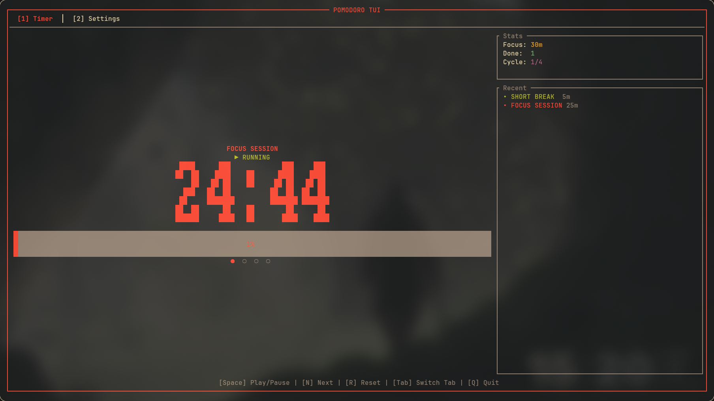

# Pomodoro TUI

[](https://www.rust-lang.org)
[](https://opensource.org/licenses/MIT)

A sophisticated, minimalist Pomodoro timer for the terminal, engineered for focus and productivity. Built with Rust using `ratatui` and `crossterm`.



## Overview

Pomodoro TUI provides a distraction-free environment for deep work. By leveraging a terminal-based interface, it minimizes system resource usage while offering a clean, responsive, and highly configurable experience.

## Key Features

*   **Intelligent Pomodoro Logic:** Seamlessly manages Focus, Short Break, and Long Break cycles with automatic transitions.
*   **Customizable Sessions:** Fine-tune durations for every phase via an intuitive in-app settings interface.
*   **System Notifications:** Integrated desktop notifications via `notify-rust` ensure you're alerted at phase transitions without needing to monitor the terminal.
*   **Responsive Terminal UI:** A modern interface built on `ratatui`, designed for clarity and ease of use.
*   **Modular Architecture:** Robustly engineered with a clear separation of concerns between application logic, state management, and UI rendering.

## Getting Started

### Prerequisites

Ensure you have the Rust toolchain installed. If not, install it via [rustup](https://rustup.rs/):

```bash
curl --proto '=https' --tlsv1.2 -sSf https://sh.rustup.rs | sh
```

### Installation

1.  **Clone the repository:**
    ```bash
    git clone https://github.com/the-daonm/pomodoro-tui.git
    cd pomodoro-tui
    ```

2.  **Build and Execute:**
    ```bash
    cargo run --release
    ```

*Note: On Linux, a notification server (e.g., `dunst`, `mako`, or `gnome-shell`) is required for system alerts.*

## Usage

### Keyboard Shortcuts

| Key | Context | Action |
| :--- | :--- | :--- |
| `Space` | Timer | Toggle Start/Pause |
| `R` | Timer | Reset current session |
| `N` | Timer | Skip to next phase |
| `1` / `2` / `3` | Timer | Switch to Focus / Short Break / Long Break |
| `Tab` | Global | Toggle between Timer and Settings |
| `Up` / `Down` (`k`/`j`) | Settings | Navigate configuration options |
| `Left` / `Right` (`h`/`l`) | Settings | Adjust durations (±5 minutes) |
| `Q` | Global | Exit application |

### Configuration

The Settings tab allows for real-time adjustments to your productivity workflow:

| Parameter | Default | Description |
| :--- | :--- | :--- |
| **Focus Duration** | 25m | Duration of intensive work sessions. |
| **Short Break** | 5m | Brief rest period between sessions. |
| **Long Break** | 15m | Extended rest after completing 4 focus cycles. |

## Roadmap

Future enhancements focused on persistence and analytics:

*   [ ] **Persistent Configuration:** Support for `.toml` or `.json` config files.
*   [ ] **Analytics Engine:** Session logging and work-time visualization.
*   [ ] **Visual Feedback:** Enhanced progress indicators for Pomodoro cycles.
*   [ ] **Extended Customization:** Theme support and configurable hotkeys.

## License

Distributed under the MIT License. See `LICENSE` for more information.
